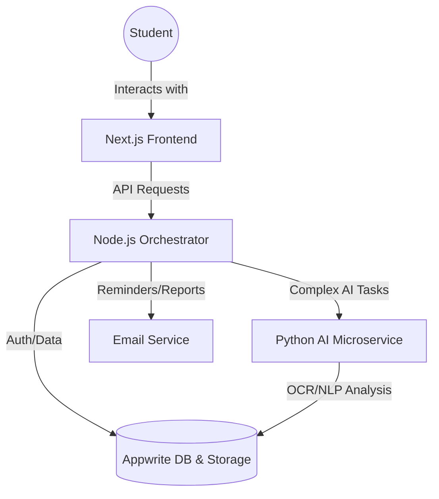

# System Architecture: Study Companion

The system is designed to be modular and scalable, separating UI, orchestration, and AI-heavy processing.

## High-Level Data Flow



## Feature Workflows

### 1. Assessment & Feedback Loop
1.  **Student** uploads handwritten notes or answers an essay via **Frontend**.
2.  **Backend** forwards the data to **AIService**.
3.  **AIService** (OCR) extracts text and performs evaluation.
4.  **AIService** generates detailed explanations with YouTube/Article citations.
5.  **Frontend** displays the interactive feedback.

### 2. Study Tracking & Streaks
1.  **Frontend** sends "heartbeat" or session ends to **Backend**.
2.  **Backend** updates `activity_logs`.
3.  **Backend** runs daily streak updates.
4.  **Backend** calculates "Exam Readiness" based on material coverage vs. target date.

### 3. Automated Notifications
1.  **Node.js cron** checks for inactivity.
2.  **Email Service** sends customized reminders or weekly summaries.
```
